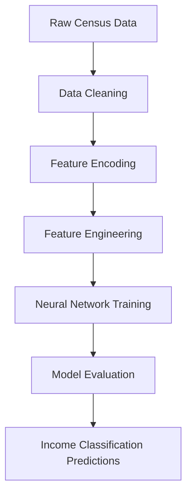

# Income Classification Neural Network


---

## Overview

This project uses a neural network built with TensorFlow and Keras to predict whether an individual's annual income exceeds $50K based on demographic and employment-related attributes.

The workflow includes:
- Data preprocessing and feature engineering
- Categorical encoding pipelines
- Neural network modeling
- Model evaluation and interpretation
- Exploratory data analysis (EDA)

The project demonstrates how deep learning can be applied to structured tabular data for binary classification problems.

---

## Project Workflow



---

# Business Problem

Organizations and researchers often need to understand which demographic and socioeconomic factors influence income levels.

Accurate income classification models can support:
- Workforce analytics
- Economic trend analysis
- Policy research
- Demographic segmentation
- Employment and compensation studies

This project predicts whether a person's income exceeds $50K annually using demographic and employment features.

---

# Dataset

The project uses census-based demographic and employment data containing:

- Age
- Education level
- Occupation
- Hours worked per week
- Marital status
- Relationship status
- Native country
- Capital gains/losses
- Income category (>50K or <=50K)

### Target Variable
- `>50K`
- `<=50K`

This is a binary classification problem.

---

# Exploratory Data Analysis (EDA)

### Key Insights
- Higher education levels showed stronger relationships with higher income categories
- Certain occupations were associated with higher predicted income levels
- Age and working hours demonstrated meaningful patterns across income groups
- Income distribution revealed moderate class imbalance

---

# Data Preprocessing

The preprocessing workflow includes:

- Missing value handling
- Ordinal encoding
- One-hot encoding for categorical variables
- Feature scaling
- Train/test splitting

### Pipeline Components
- `ColumnTransformer`
- `OneHotEncoder`
- `OrdinalEncoder`
- `StandardScaler`

The preprocessing pipeline ensures reproducibility and consistent model input formatting.

---

# Neural Network Architecture

The model was built using TensorFlow/Keras.


### Training Configuration
- Loss Function: Binary Crossentropy
- Optimizer: Adam
- Metric: Accuracy

---

# Model Performance

The neural network achieved strong classification performance on the testing dataset.

### Evaluation Metrics
- Accuracy
- Precision
- Recall
- F1-score

### Key Findings
- Neural networks effectively captured nonlinear relationships within demographic data
- Proper preprocessing significantly improved model stability
- Feature engineering and encoding techniques enhanced predictive performance
- Education and occupation were among the strongest predictive indicators

---

# Model Interpretation

The model demonstrates how deep learning techniques can be applied to structured demographic datasets for predictive analytics.

Potential applications include:
- Workforce analytics
- Economic forecasting
- Demographic research
- Employment trend analysis
- Income segmentation studies

---

# Technologies Used

- Python
- TensorFlow / Keras
- pandas
- NumPy
- scikit-learn
- matplotlib
- seaborn
- Jupyter Notebook

---

# Repository Structure

```text
income-classification-neural-network/
│
├── data/
├── notebooks/
├── README.md
└── requirements.txt
```

---

# How to Run

1. Clone the repository
2. Install required dependencies
3. Open the notebook in Jupyter Notebook or Google Colab
4. Run all notebook cells sequentially

```bash
pip install -r requirements.txt
```

---

# Future Improvements

- Hyperparameter tuning
- Additional neural network architectures
- Feature importance analysis
- Class imbalance optimization
- Dashboard deployment for interactive prediction analysis

---

# Author

**Pranika Chandra**  
Projects focused on machine learning, predictive analytics, neural networks, and applied data science.
